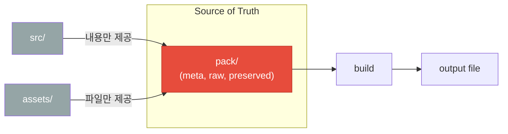
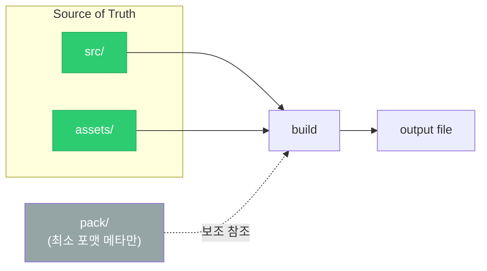
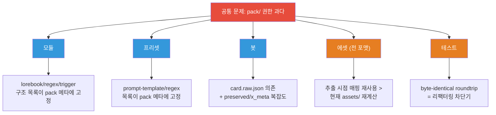
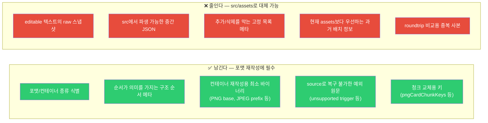
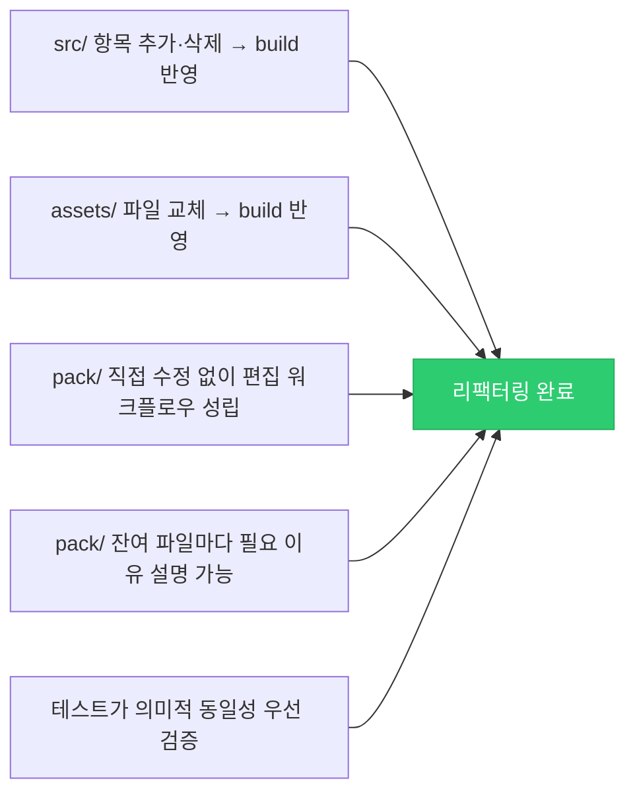

# pack 리팩터링 계획 v2

> **한 줄 요약** — `pack/`의 권한을 줄이고, 편집 결과의 기준을 `src/` + `assets/`로 옮긴다.

---

## 1. 핵심 원칙

```
질문: 이 정보가 build에 "필요한가", 아니면 추출 당시 상태를 "그대로 복구"하려는 것인가?
```

| 우선순위 | 의사결정 기준 |
|:---:|---|
| 1 | 사용자가 편집하는 대상인가? |
| 2 | `src/` 또는 `assets/`에서 다시 읽어야 하는가? |
| 3 | `pack/` 없이 **재계산** 가능한가? |
| 4 | 재계산 불가능하면 어떤 **최소 메타**만 남기는가? |

---

## 2. 현재 vs 목표 — 전체 그림

아래 다이어그램은 리팩터링 전후의 **데이터 권한** 흐름을 비교한다.

### Before (현재)



### After (목표)



---

## 3. 포맷별 문제 & 목표

### 3.1 공통 문제 구조

모든 포맷에 걸친 문제는 하나다: **`pack/`이 목록·순서·연결의 권한을 쥐고 있다.**



### 3.2 포맷별 현재 → 목표 요약

| 포맷 | 영역 | 현재 (문제) | 목표 |
|---|---|---|---|
| **모듈** `.risum` | 텍스트 구조 | lorebook/regex/trigger 목록 → `pack/*.meta.json` 의존 | `src/lorebook`, `src/regex` 스캔으로 재구성, trigger는 모드별 유지 |
| | 에셋 | `module.assets.json`의 `sourceIndex` 고정 재사용 | `assets/` 현재 상태 기준 재매핑, 식별자만 메타 보존 |
| **프리셋** `.risup` `.risupreset` | 텍스트 구조 | prompt-template/regex 목록 → `pack` 메타 의존 | `src/prompt-template`, `src/regex` 스캔으로 재구성 |
| **봇 (공통)** | 카드 구조 | `card.raw.json` 위에 editable 덮어쓰기 | raw 의존 축소, editable/derived/preserved 경계 명시 |
| **봇 PNG** | 에셋/컨테이너 | `pngAssets`, `chunkKey`, `assetIndex` 고정 | 현재 `assets/` 기준 재계산 + 청크 키 보존 |
| **봇 ZIP** `.charx` `.jpg` `.jpeg` | 에셋/컨테이너 | `sourcePath`, preserved 컨테이너 정보 재사용 | 현재 `assets/` 기준 재매핑 + 컨테이너 식별자만 보존 |
| **테스트** | roundtrip | raw/preserved byte-identical 강제 | 편집 결과의 **의미적 동일성** 검증으로 전환 |

---

## 4. `pack/` 보존 기준 — 한 장 정리



### 포맷별 최소 보존 메타

| 포맷 | 반드시 유지 | 줄여도 됨 | 주의 사항 |
|---|---|---|---|
| **모듈** `.risum` | module 객체 field shape, asset 순서 대응, unsupported trigger 원문 | editable lorebook/regex raw, `pack/dist/module.json` | trigger는 `lua` / `v2` / `unsupported-v1` 모드 유지 |
| **프리셋** `.risup` `.risupreset` | preset field shape, `outerType`/`presetVersion`, promptTemplate 아이템 순서·타입 | `preset.raw.json`, 중간 preset JSON, 고정 파일 목록 | promptTemplate는 파일명 prefix 순 등 명시된 규칙으로 정렬 |
| **PNG 봇** | 카드 청크 키, asset 청크 키 목록, base PNG 컨테이너 | editable 카드 raw, 과거 asset 목록 | 청크 교체는 공식 포맷 규칙 → 최소 메타 유지 |
| **ZIP 봇** `.charx` `.jpg` `.jpeg` | 컨테이너 종류, JPEG prefix, module.risum 내장 여부, archive path 매핑, x_meta 식별 정보 | `card.raw.json`, 불필요한 preserved 사본 | 작업장에서 asset명 변경 가능 → pack 직전 archive path 복원 필수 |

---

## 5. 구현 로드맵

```mermaid
gantt
    title 리팩터링 단계별 로드맵
    dateFormat X
    axisFormat %s

    section 1단계 — 기준 전환
    테스트 목적 전환: crit, t1, 0, 1
    pack 파일 분류 문서화: t2, 0, 1

    section 2단계 — 모듈
    src/lorebook 스캔 전환: m1, 1, 2
    src/regex 스캔 전환: m2, 1, 2
    trigger source 재조립 (모드 유지): m3, 1, 2

    section 3단계 — 프리셋
    src/prompt-template 스캔 + 정렬 규칙 확정: p1, 2, 3
    src/regex 스캔 전환: p2, 2, 3

    section 4단계 — 봇 카드
    raw 필드 분해 (editable/derived/preserved): b1, 3, 4
    editable 필드 raw 독립 build: b2, 3, 4

    section 5단계 — 에셋 재계산
    모듈 asset 재매핑: a1, 4, 5
    ZIP 봇 asset 재매핑: a2, 4, 5
    PNG 봇 asset 재매핑: a3, 4, 5

    section 6단계 — preserved 최소화
    제거 대상 정리: x1, 5, 6
    최종 보존 목록 확정: x2, 5, 6
```



### 단계별 상세

| 단계 | 요약 | 핵심 원칙 | 수정 대상 파일 |
|:---:|---|---|---|
| **1** | 기준 전환 | 동작 변경 전에 **기준 변경** 먼저 | `tests/roundtrip-smoke.mjs` |
| **2** | 모듈 목록 권한 이동 | `pack` 메타 → build 보조 자료로 강등 | `src/formats/risum/source-module*.ts` |
| **3** | 프리셋 목록 권한 이동 | 위와 동일 | `src/formats/risup/source-risup.ts` |
| **4** | 봇 raw 의존 축소 | 필드별 분해 → raw 0을 강제하지 않되, 이유를 명시 | `src/formats/bot/source-card.ts`, `source-bot.ts` |
| **5** | 에셋 재계산 중심 전환 | "현재 파일이 우선, `pack/` 메타는 식별·재배치 보조" | `container-zip.ts`, `container-png.ts` |
| **6** | preserved 최소화 | 포맷 유지 필수 바이너리만 남김 | `src/types/*.ts`, README |

> **순서의 이유**: 테스트가 막으면 아무것도 못 바꾸므로 1단계가 먼저.
> 모듈/프리셋은 구조 분해가 상대적으로 쉬워서 봇보다 앞에 배치.

---

## 6. 완료 조건 & 비목표

### ✅ 완료 조건



### 🚫 비목표

- 모든 preserved 데이터를 한 번에 제거
- 모든 포맷을 동일 내부 표현으로 통합
- 작업장 구조를 즉시 뒤엎기
- 전 포맷 byte-identical roundtrip 보장

> 이번 작업은 **"새 설계"가 아니라 "현재 코드를 `src/` + `assets/` 중심으로 이동시키는 전환 작업"**이다.

---

## 7. 작업 규칙

| 주체 | 수정 대상 | 규칙 |
|---|---|---|
| 사람 / AI | `src/`, `assets/` | 자유롭게 수정 |
| 사람 / AI | `pack/` | ⛔ 원칙적 금지 — 예외 시 이유 문서화 필수 |
| 새 `pack` 파일 추가 시 | — | **필수 build 메타** vs **임시 마이그레이션 메타** 표시 |
| 테스트 | — | raw 보존보다 **편집 반영**을 먼저 확인 |
