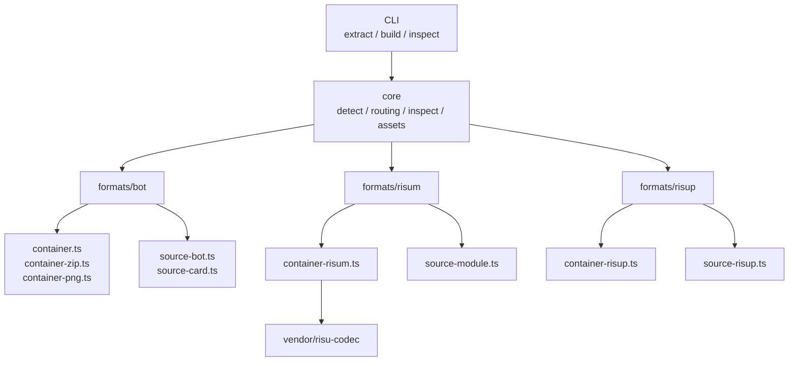
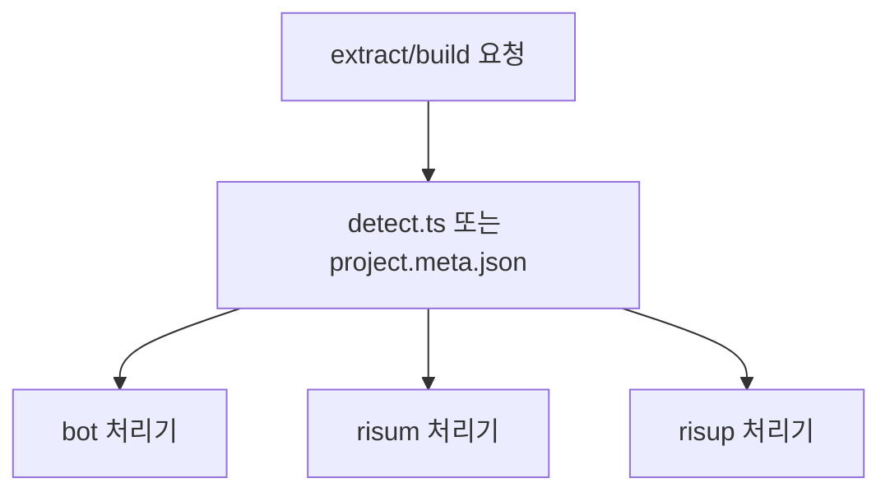
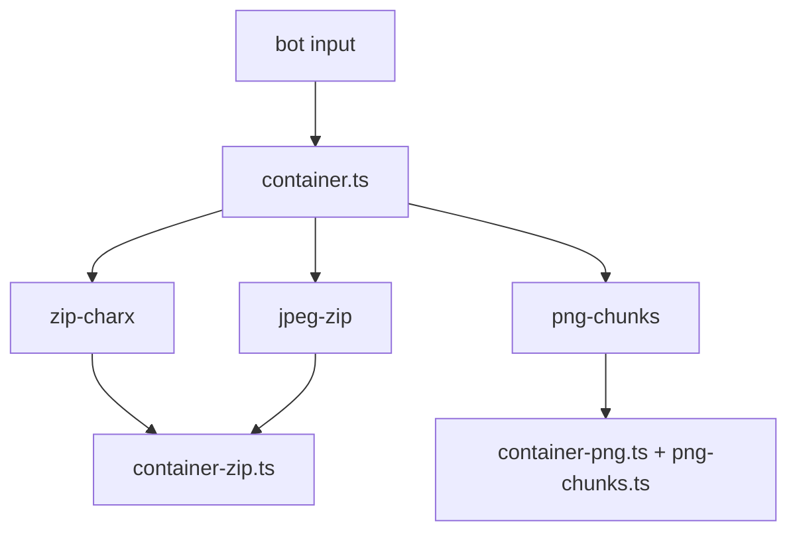
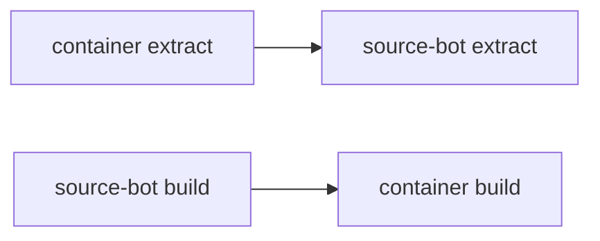
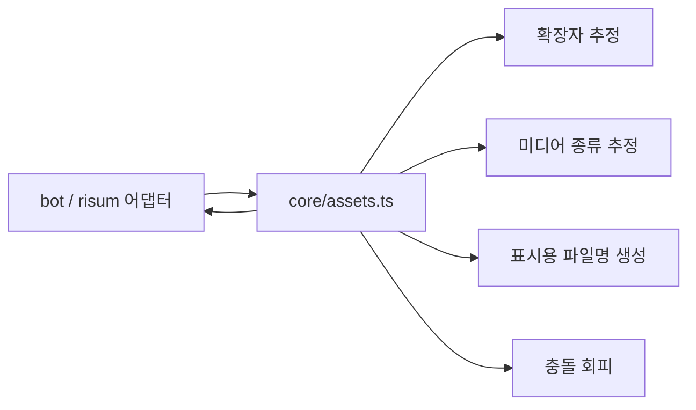
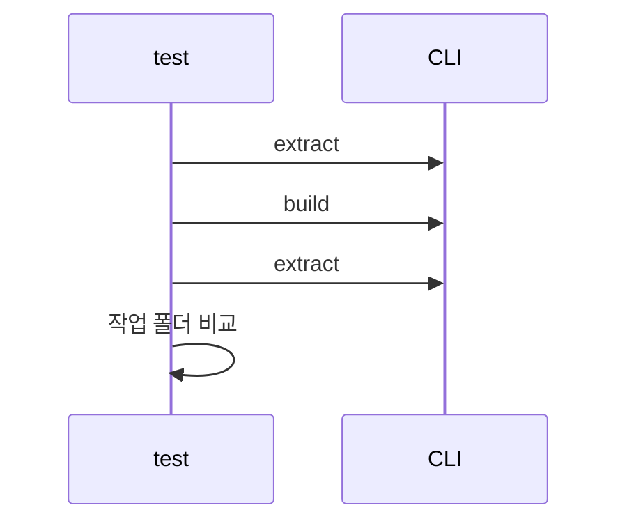

# 프로젝트 구조 설계

> 이 문서는 **현재 구현 기준의 구조 문서**입니다.

현재 구현의 핵심 권한:

- `src/`와 `assets/`가 build 입력의 기준
- `pack/`은 포맷 식별, 재작성 식별자, unsupported 원문 보존 같은 최소 메타

## 1. 현재 코드 구조



```text
RisuCMP/
├─ src/
│  ├─ cli/
│  │  └─ main.ts
│  ├─ core/
│  │  ├─ assets.ts
│  │  ├─ detect.ts
│  │  ├─ inspect.ts
│  │  ├─ project-meta.ts
│  │  ├─ project-paths.ts
│  │  └─ routing.ts
│  ├─ formats/
│  │  ├─ bot/
│  │  │  ├─ container.ts
│  │  │  ├─ source-bot.ts
│  │  │  ├─ source-card.ts
│  │  │  ├─ container-zip.ts
│  │  │  ├─ index.ts
│  │  │  ├─ paths.ts
│  │  │  ├─ png-chunks.ts
│  │  │  ├─ container-png.ts
│  │  │  └─ shared.ts
│  │  └─ risum/
│  │     ├─ container-risum.ts
│  │     ├─ index.ts
│  │     ├─ inspect.ts
│  │     ├─ source-module.ts
│  │     ├─ paths.ts
│  │     └─ ...
│  │  ├─ risup/
│  │  │  ├─ container-risup.ts
│  │  │  ├─ index.ts
│  │  │  ├─ inspect.ts
│  │  │  ├─ paths.ts
│  │  │  └─ source-risup.ts
│  └─ types/
│     ├─ bot.ts
│     ├─ module.ts
│     ├─ preset.ts
│     └─ project.ts
├─ vendor/
│  └─ risu-codec/
├─ tests/
│  └─ roundtrip-smoke.mjs
└─ docs/
```

---

## 2. 공통 진입점

- `extract`
- `build`
- `inspect`



- `.risum` -> 모듈 처리기
- `.risup`, `.risupreset` -> 프리셋 처리기
- `.charx`, `.png`, `.jpg`, `.jpeg` -> 봇 처리기
- `build`는 `project.meta.json`의 `kind`를 보고 처리기 선택

---

## 3. 봇 처리기 구조

- `container`
- `source`



- `zip-charx`
- `jpeg-zip`
- `png-chunks`



---

## 4. 공용 에셋 처리 구조



- 시그니처 기반 확장자 추정
- 이미지/오디오/비디오/바이너리 판정
- 사람이 읽기 쉬운 파일명 생성
- 이름 충돌 방지
- 프로젝트 상대경로 계산
- 원래 경로 보존
- 청크 키 보존
- 에셋 순서 보존
- 현재 `assets/` 스캔 우선

---

## 5. 현재 작업 폴더 구조

## 5.1 봇 작업 폴더

```text
my-bot/
├─ project.meta.json
├─ src/
│  ├─ card/
│  │  ├─ name.txt
│  │  ├─ description.md
│  │  ├─ first-message.md
│  │  ├─ alternate-greetings/
│  │  │  ├─ 001.md
│  │  │  └─ ...
│  │  ├─ global-note.md
│  │  ├─ default-variables.txt
│  │  └─ styles/
│  │     └─ background.css
│  └─ module/
│     ├─ src/
│     │  ├─ lorebook/
│     │  ├─ regex/
│     │  ├─ trigger.lua | trigger.json | trigger.unsupported.txt
│     │  └─ styles/
│     ├─ pack/
│     └─ assets/
├─ pack/
│  ├─ bot.meta.json
│  ├─ card/
│  │  └─ card.meta.json
│  ├─ dist/
│  │  ├─ card.json
│  │  └─ module.risum
│  ├─ x_meta/
│  └─ _preserved/
├─ assets/
│  └─ .gitignore
└─ dist/
```

- `src/card/name.txt` 등 텍스트 파일
- `pack/card/card.meta.json`
- `pack/card/card.meta.json`은 editable 제외 base card + editable source 경로 설명
- `pack/dist/card.json`
- `src/module/`
- `assets/`
- `pack/x_meta/`
- `pack/_preserved/`

## 5.2 모듈 작업 폴더

```text
my-module/
├─ project.meta.json
├─ src/
│  ├─ lorebook/
│  │  ├─ _root/
│  │  └─ ...
│  ├─ regex/
│  │  ├─ some-regex.json
│  │  └─ ...
│  ├─ trigger.lua | trigger.json | trigger.unsupported.txt
│  ├─ styles/
│  └─ ...
├─ pack/
│  ├─ module.json
│  ├─ module.assets.json
│  ├─ module.meta.json
│  ├─ lorebook.meta.json
│  ├─ regex.meta.json
│  ├─ trigger.meta.json
│  └─ dist/
│     └─ module.json
├─ assets/
│  └─ .gitignore
└─ dist/
```

- `pack/module.json`
- `pack/module.assets.json`
- `pack/module.meta.json`
- `pack/lorebook.meta.json`
- `pack/regex.meta.json`
- `pack/trigger.meta.json`
- `pack/dist/module.json`
- build 시 lorebook/regex 목록은 `src/` 스캔 기준
- `pack/module.assets.json`은 asset 식별자(`sourceIndex`) 보조 메타

## 5.3 프리셋 작업 폴더

```text
my-preset/
├─ project.meta.json
├─ src/
│  ├─ name.txt
│  ├─ main-prompt.md
│  ├─ jailbreak.md
│  ├─ global-note.md
│  ├─ custom-prompt-template-toggle.txt
│  ├─ template-default-variables.txt
│  ├─ prompt-template/
│  │  ├─ 001-*.json
│  │  ├─ 001-*.md
│  │  └─ ...
│  └─ regex/
│     ├─ *.json
│     └─ ...
├─ pack/
│  ├─ preset.raw.json
│  ├─ preset.meta.json
│  ├─ risup.meta.json
│  ├─ prompt-template.meta.json
│  ├─ regex.meta.json
│  └─ dist/
│     └─ preset.json
└─ dist/
```

- build 시 prompt-template/regex 목록은 `src/` 스캔 기준
- `prompt-template.meta.json`, `regex.meta.json`은 추출 시점 보조 메타

---

## 6. 테스트 구조



- `tests/roundtrip-smoke.mjs`
- synthetic/security 기본 검증
- sample manifest가 있을 때 포맷별 roundtrip 추가 검증
- editable 텍스트 파일 동일
- 현재 `src/`/`assets/` 반영 우선
- PNG 청크 키 동일
- preserved 파일 동일
- 모듈 `dist/module.json` roundtrip 동일
- `pack` 메타를 비워도 source 스캔이 우선되는 synthetic 케이스 포함
