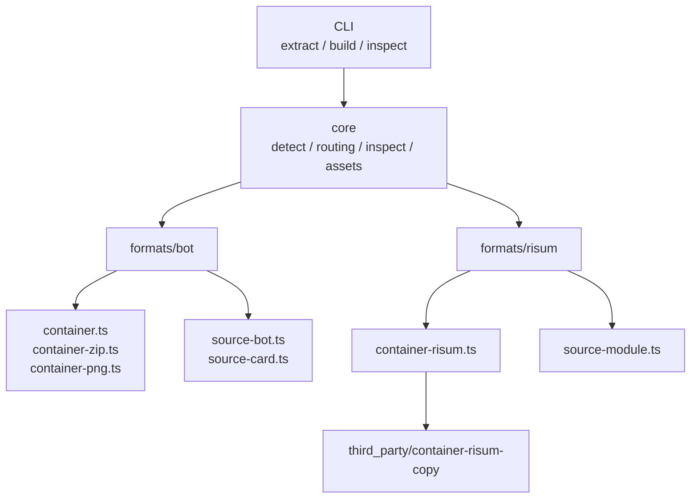
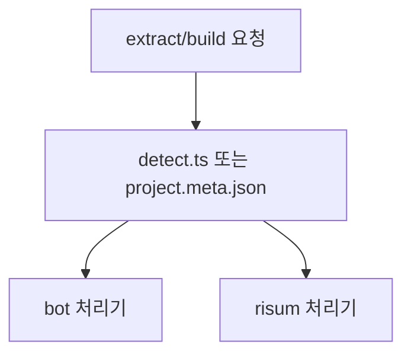
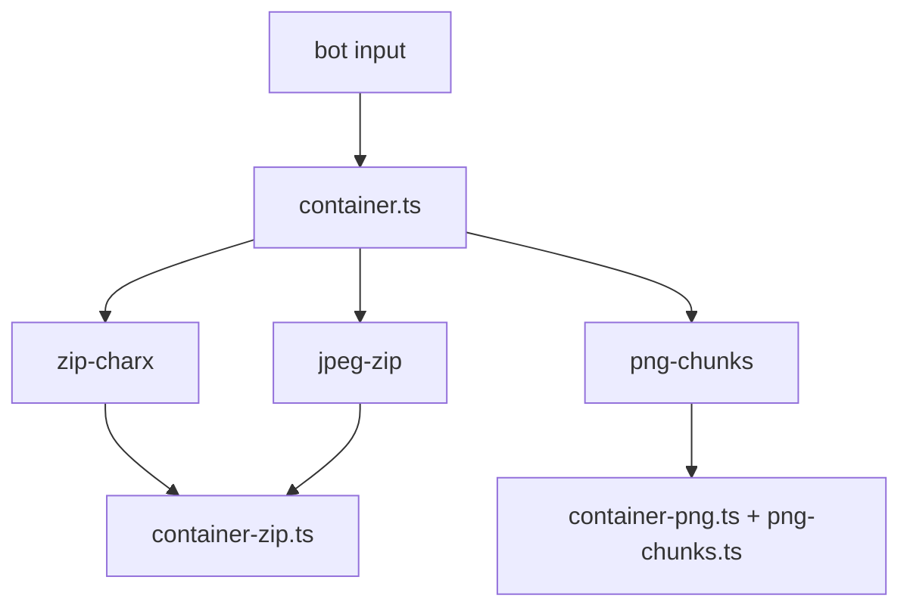
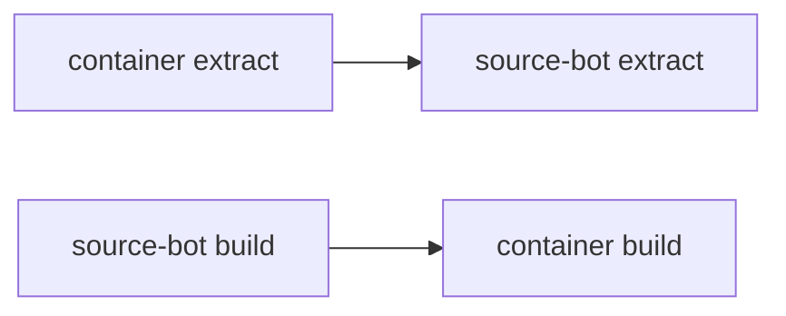
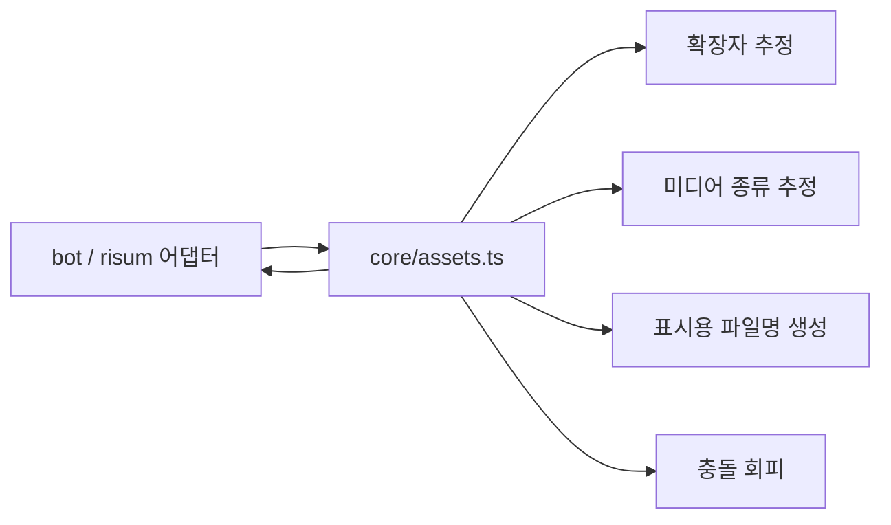
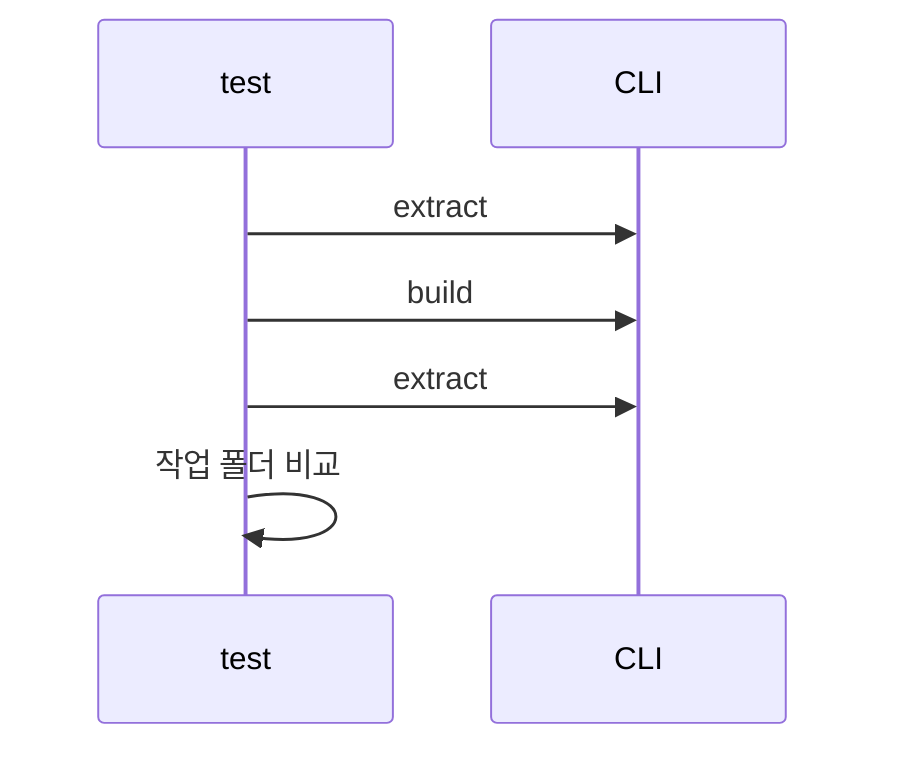

# 프로젝트 구조 설계

> 이 문서는 **현재 구현 기준의 구조 문서**입니다.  
> `risup`은 후속 작업입니다.

## 1. 현재 코드 구조



현재 구현은 TypeScript 기반입니다.

```text
RisuCMP/
├─ src/
│  ├─ cli/
│  │  └─ main.ts
│  ├─ core/
│  │  ├─ assets.ts
│  │  ├─ detect.ts
│  │  ├─ inspect.ts
│  │  ├─ project-meta.ts
│  │  ├─ project-paths.ts
│  │  └─ routing.ts
│  ├─ formats/
│  │  ├─ bot/
│  │  │  ├─ container.ts
│  │  │  ├─ source-bot.ts
│  │  │  ├─ source-card.ts
│  │  │  ├─ container-zip.ts
│  │  │  ├─ index.ts
│  │  │  ├─ paths.ts
│  │  │  ├─ png-chunks.ts
│  │  │  ├─ container-png.ts
│  │  │  └─ shared.ts
│  │  └─ risum/
│  │     ├─ container-risum.ts
│  │     ├─ index.ts
│  │     ├─ inspect.ts
│  │     ├─ source-module.ts
│  │     └─ paths.ts
│  └─ types/
│     ├─ bot.ts
│     ├─ module.ts
│     └─ project.ts
├─ third_party/
│  ├─ container-risum-copy/
│  └─ source-module-copy/
├─ tests/
│  └─ roundtrip-smoke.mjs
└─ docs/
```

---

## 2. 공통 진입점

CLI는 하나만 둡니다.

- `extract`
- `build`
- `inspect`

라우팅은 `src/core/routing.ts`가 맡습니다.



규칙은 단순합니다.

- `.risum` -> 모듈 처리기
- `.charx`, `.png`, `.jpg`, `.jpeg` -> 봇 처리기
- `build`는 `project.meta.json`의 `kind`를 보고 처리기 선택

---

## 3. 봇 처리기 구조

봇 쪽도 모듈과 같은 두 단계 구조입니다.

- `container` 단계
  - 실제 파일 포맷을 해제/재조립
- `source` 단계
  - 카드 본체와 embedded 모듈을 편집 파일 구조로 분해/조립

봇 컨테이너 쪽은 확장자가 아니라 **실제 컨테이너 시그니처**를 보고 처리합니다.



현재 지원하는 실컨테이너:

- `zip-charx`
- `jpeg-zip`
- `png-chunks`

즉 `.charx`라도 실제 바이트 구조가 JPEG+ZIP이면 `jpeg-zip`으로 처리합니다.

봇 extract/build 흐름은 내부적으로 아래 순서를 따릅니다.



---

## 4. 공용 에셋 처리 구조

에셋은 포맷별 재조합 기준이 다르므로 완전 공용으로 합치지 않습니다.

대신 공용 저수준 로직을 하나 둡니다.



공용 로직이 하는 일:

- 시그니처 기반 확장자 추정
- 이미지/오디오/비디오/바이너리 판정
- 사람이 읽기 쉬운 파일명 생성
- 이름 충돌 방지
- 프로젝트 상대경로 계산

포맷별 어댑터가 하는 일:

- 원래 경로 보존
- 청크 키 보존
- 에셋 순서 보존

즉 재조합 기준은 항상 포맷별 메타에 남깁니다.

---

## 5. 현재 작업 폴더 구조

## 5.1 봇 작업 폴더

```text
my-bot/
├─ project.meta.json
├─ src/
│  ├─ card/
│  │  ├─ name.txt
│  │  ├─ description.md
│  │  ├─ first-message.md
│  │  ├─ alternate-greetings/
│  │  │  ├─ 001.md
│  │  │  └─ ...
│  │  ├─ global-note.md
│  │  ├─ default-variables.txt
│  │  └─ styles/
│  │     └─ background.css
│  └─ module/
│     ├─ src/
│     │  ├─ lorebook/
│     │  ├─ regex/
│     │  └─ trigger.lua
│     ├─ pack/
│     └─ assets/
├─ pack/
│  ├─ bot.meta.json
│  ├─ card/
│  │  ├─ card.meta.json
│  │  └─ card.raw.json
│  ├─ x_meta/
│  └─ _preserved/
├─ assets/
│  └─ .gitignore
└─ dist/
```

역할은 아래와 같습니다.

- `src/card/name.txt` 등 텍스트 파일
  - 카드 본체 직접 편집 대상
- `pack/card/card.meta.json`
  - 카드 소스 파일 구조 설명
- `pack/card/card.raw.json`
  - 원본 카드 전체 보존
- `pack/dist/card.json`
  - source 단계에서 다시 만든 카드 JSON
- `src/module/`
  - embedded `module.risum`이 있으면 모듈 하위 프로젝트 생성
- `assets/`
  - 추출된 에셋
- `pack/x_meta/`
  - ZIP형 봇의 메타 파일
- `pack/_preserved/`
  - 재조합 때 그대로 다시 써야 하는 보존 파일

현재 editable 범위:

- `src/card/name.txt`
- `src/card/description.md`
- `src/card/first-message.md`
- `src/card/alternate-greetings/*.md`
- `src/card/global-note.md`
- `src/card/default-variables.txt`
- `src/card/styles/background.css`

참고:

- embedded `module.risum`이 있으면 `src/module/` 아래에 모듈 작업 폴더가 실제로 생성됩니다.
- 그래서 봇의 로어북 / 정규식 / Lua는 결국 `src/module/src/...` 쪽에서 편집합니다.
- build 때는 `source-bot` 단계가 `pack/dist/card.json`, `pack/dist/module.risum`을 만들고, `container` 단계가 그 결과를 최종 봇 파일로 조립합니다.

## 5.2 모듈 작업 폴더

```text
my-module/
├─ project.meta.json
├─ src/
│  ├─ lorebook/
│  │  ├─ _root/
│  │  └─ ...
│  ├─ regex/
│  │  ├─ some-regex.json
│  │  └─ ...
│  ├─ trigger.lua
│  ├─ styles/
│  └─ ...
├─ pack/
│  ├─ module.json
│  ├─ module.assets.json
│  ├─ module.meta.json
│  ├─ lorebook.meta.json
│  ├─ regex.meta.json
│  └─ dist/
│     └─ module.json
├─ assets/
│  └─ .gitignore
└─ dist/
```

역할은 아래와 같습니다.

- `pack/module.json`
  - `module-vcs`가 다루는 소스 기준 JSON
- `pack/module.assets.json`
  - 공용 에셋 정규화 메타
- `pack/module.meta.json`
  - `module-vcs` 추출 메타
- `pack/regex.meta.json`
  - 정규식 순서와 빌드 메타
- `src/`
  - `module-vcs` 스타일 분해 결과
- `pack/lorebook.meta.json`
  - 로어북 순서와 폴더 구조를 보존하는 패킹 메타
- `pack/dist/module.json`
  - build로 다시 만든 결과 JSON

즉 모듈은:

1. `.risum` unpack
2. TS로 옮긴 `module-vcs` 규칙으로 extract
3. 소스 수정
4. 같은 규칙으로 build
5. `.risum` repack

흐름으로 동작합니다.

참고:

- 로어북은 flat `_meta.json` 대신 `src/lorebook/` 폴더 구조와 `pack/lorebook.meta.json`으로 재조립합니다.
- 로어북 엔트리는 기본적으로 모두 `.md`로 분해합니다.
- 즉 내용이 `return`으로 시작하거나 `<style>`을 포함해도 로어북 엔트리를 `.lua`나 `.css`로 자동 추측하지 않습니다.
- 정규식은 `src/regex/*.json`으로 개별 분해하고 `pack/regex.meta.json`으로 다시 조립합니다.
- 여러 `triggerlua`가 있으면 각각의 원래 위치를 보존해서 다시 연결합니다.
- `backgroundEmbedding`은 `src/styles/embedding.css`로 별도 분해합니다.

---

## 6. 테스트 구조

현재 테스트는 자동 roundtrip 스모크 테스트입니다.



검증 파일:

- `tests/roundtrip-smoke.mjs`

현재 검증 대상:

- `risum`
- `charx`
- `jpg/jpeg`
- `png`

검증 항목 예:

- editable 텍스트 파일 동일
- 에셋 수 동일
- PNG 청크 키 동일
- preserved 파일 동일
- 모듈 `dist/module.json` roundtrip 동일

---

## 7. 후속 작업

현재 구조 문서에서 아직 후속 작업으로 남겨 둔 것은 아래입니다.

- `risup`
- 추가 inspect 출력 확장
- 더 넓은 editable 범위

---

## 8. 한 줄 요약

현재 구조는 **공통 CLI + 공통 저수준 로직 + 포맷별 어댑터 + 기존 도구 복사본 활용**으로 정리되어 있고,
1차 목표에 맞춰 기존 도구 수준의 `extract / build / inspect`를 다른 포맷에도 확장하는 형태입니다.
