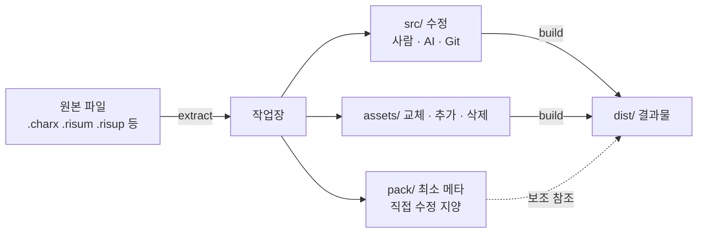
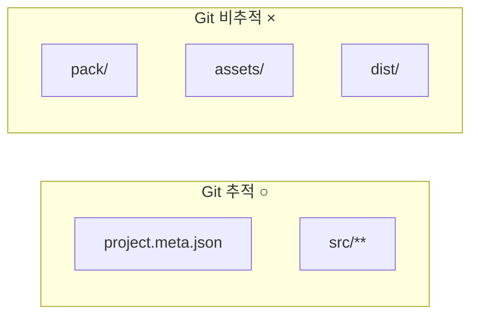
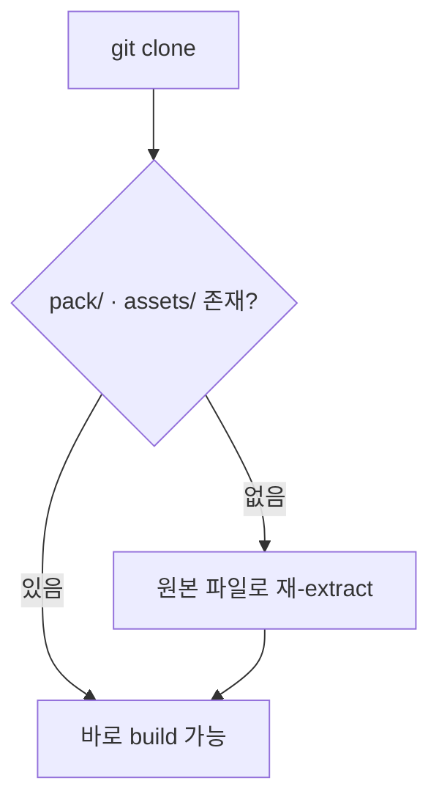

# 작업장 구조 (v2)

> 사용자가 관리하는 **작업장(workspace)** 구조 레퍼런스.
> 도구(RisuCMP) 내부 구조는 → [project-structure.md](./project-structure.md)

---

## 전체 흐름



---

## 도구 vs 작업장

```text
C:\Dev\RisuCMP\                         ← 도구 저장소 (clone)
C:\Users\<user>\RisuWorkspaces\         ← 작업장 루트 (권장)
  ├─ my-bot\
  ├─ my-module\
  └─ my-preset\
```

> **규칙**: 작업장은 도구 저장소 밖에 둔다.
> `RisuCMP\workspace\`는 개발 테스트 전용.

---

## 작업장 내부 구조

### 봇

```text
my-bot/
├─ project.meta.json
├─ src/
│  ├─ card/
│  │  ├─ name.txt
│  │  ├─ description.md
│  │  ├─ first-message.md
│  │  ├─ alternate-greetings/
│  │  ├─ global-note.md
│  │  ├─ default-variables.txt
│  │  └─ styles/
│  └─ module/           ← 내장 모듈이 있을 때
│     ├─ src/
│     │  ├─ lorebook/
│     │  ├─ regex/
│     │  ├─ trigger.lua | trigger.json
│     │  └─ styles/
│     ├─ pack/
│     └─ assets/
├─ pack/
│  ├─ bot.meta.json
│  ├─ card/
│  │  └─ card.meta.json
│  ├─ dist/
│  ├─ x_meta/
│  └─ _preserved/
├─ assets/
└─ dist/
```

### 모듈

```text
my-module/
├─ project.meta.json
├─ src/
│  ├─ lorebook/
│  ├─ regex/
│  ├─ trigger.lua | trigger.json
│  └─ styles/
├─ pack/
│  ├─ module.json
│  ├─ module.assets.json
│  ├─ module.meta.json
│  ├─ lorebook.meta.json
│  ├─ regex.meta.json
│  ├─ trigger.meta.json
│  └─ dist/
├─ assets/
└─ dist/
```

### 프리셋

```text
my-preset/
├─ project.meta.json
├─ src/
│  ├─ name.txt
│  ├─ main-prompt.md
│  ├─ jailbreak.md
│  ├─ global-note.md
│  ├─ custom-prompt-template-toggle.txt
│  ├─ template-default-variables.txt
│  ├─ prompt-template/
│  └─ regex/
├─ pack/
│  ├─ preset.raw.json
│  ├─ preset.meta.json
│  ├─ risup.meta.json
│  ├─ prompt-template.meta.json
│  ├─ regex.meta.json
│  └─ dist/
└─ dist/
```

---

## 영역별 역할

| 영역                | 역할                                  | 사람 수정 | AI 수정 | Git 추적 | build 필요 |
| ------------------- | ------------------------------------- | :-------: | :-----: | :------: | :--------: |
| `project.meta.json` | extract가 자동 생성하는 프로젝트 메타 |     ×     |    ×    |    ○     |     ○      |
| `src/`              | 텍스트 콘텐츠와 editable source       |     ○     |    ○    |    ○     |     ○      |
| `pack/`             | 최소 build 메타와 보존 데이터         |     ×     |    ×    |    ×     |     ○      |
| `assets/`           | 현재 build에 들어갈 바이너리 자산     |     ○     |    ○    |    ×     |     ○      |
| `dist/`             | 빌드 결과물                           |     ×     |    ×    |    ×     |     —      |

> ○ 기본 대상 / △ 필요 시 / × 하지 않음

> [!NOTE]
> build의 기준은 `src/`와 `assets/`이다.
> `pack/`은 컨테이너 종류, 청크 키, unsupported 원문, archive path 같은
> **재작성에 필요한 최소 메타**만 들고 있어야 한다.

> [!WARNING]
> `pack/`은 직접 수정하지 않는 것을 기본 원칙으로 한다.
> 새 환경에서 작업을 시작할 때는 원본 파일에서 다시 `extract`하는 것이 가장 안전하다.

---

## AI 에이전트 지침

CMP는 extract 시 **기본 에이전트 지침 파일을 작업장에 생성**할 수 있다 (계획).
사용자는 이를 그대로 쓰거나, 자신의 작업장에 맞게 커스텀·확장할 수 있다.

```text
my-workspace/
├─ AGENTS.md                           ← 상위 규칙 (CMP 기본 제공 → 사용자 커스텀)
└─ .agents/skills/risu-workspace/
   └─ SKILL.md                         ← 상세 작업 절차 (CMP 기본 제공 → 사용자 커스텀)
```

| 파일        | 내용 예시                                              |
| ----------- | ------------------------------------------------------ |
| `AGENTS.md` | 수정 대상은 `src/`, `pack/` 직접 수정 금지, 빌드 명령  |
| `SKILL.md`  | 우선 읽을 파일, lorebook 편집 규칙, 빌드 전 체크리스트 |

> 현재 CMP의 `.agents/skills/risu-workspace-tools/SKILL.md`는
> **도구 저장소 자체**의 개발 스킬이며, 사용자 작업장용 스킬과는 별개이다.

---

## Git 정책

### .gitignore

```gitignore
pack/
assets/
dist/
.tmp/
.cache/
Thumbs.db
Desktop.ini
```

> `pack/`과 `assets/`를 Git에 넣지 않는 이유는 "불필요해서"가 아니라
> 원본에서 다시 만들 수 있거나 로컬 작업 상태에 가까운 데이터이기 때문이다.
> 팀 워크플로우에 따라 예외는 가능하지만, 기본값은 비추적이다.

### 추적 대상 요약



### 새 환경에서의 복원 흐름



---

## CLI 사용 예시

```powershell
# extract
risu-workspace-tools extract C:\input\sample.risum C:\Users\<user>\RisuWorkspaces\sample

# 작업장으로 이동 후 빌드
Set-Location C:\Users\<user>\RisuWorkspaces\sample
risu-workspace-tools build .

# inspect
risu-workspace-tools inspect C:\input\sample.risum
```

---

## v1 문서와의 용어 대응

v1에서 제안했던 이름과 실제 구현 이름의 대응표.

| v1 제안    | 실제 구현 | 비고                   |
| ---------- | --------- | ---------------------- |
| `content/` | `src/`    | 사람이 수정하는 콘텐츠 |
| `.cmp/`    | `pack/`   | 빌드용 내부 데이터     |
| `dist/`    | `dist/`   | 동일                   |
